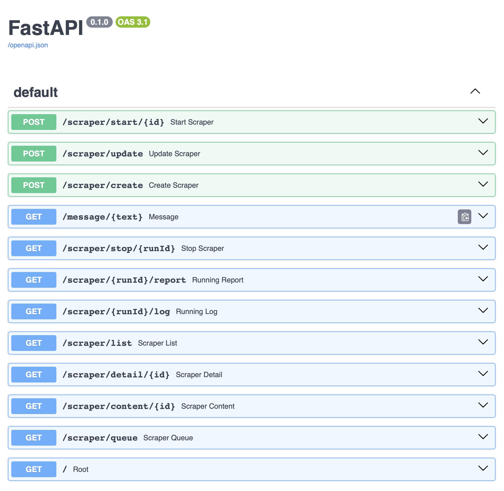

# Install

Please follow these instructions to run the **jobiq-intel**

## Docker

This is the preferred way of running the parser. Please follow these instructions:

### 1. Define Environment

You must define your environment variable. The fastest way is to copy the `.env.example` to `.env` and set your values:

```
DATABASE_URL=postgresql://
MANAGER_PORT=4000
MANAGER_RELOAD=true
MAIL_PASSWORD=
GEMINI_API_KEY=if you plan to use gemini
```

### 2. Create Container

First, we need to build the container, please change the name `jobiq-intel` to whatever you would like your image be named

```bash
docker build --platform=linux/amd64 -t jobiq-intel .
```

for scraper make sure to modify the entrypoint.sh

```bash
docker build --platform=linux/amd64 -t jobiq-scraper .
```

### 3. Prepare Scrapers

You need to define your first scraper to start scraping. The scraper stores the scraper data in the database, but you can easily load it. For this, you will need two files in the root of your project:

- ScraperName-scraper.yaml (contains general scraper info)
- ScraperName-content.yaml (contains scraping logic)

The example in the `google-scraper.yaml` is:

```yaml
name: google.com
source: google-content.yaml # path to the content file
logo: ""
propertySchema: # which properties does this scraper require
  type: object
  properties:
    pages:
      type: int
schedule: # cron type of schedule when your project should run
type: Job # what are you scraping
url: ""
```

The example content in `google-content.yaml` is:

```yaml
actions:
  - name: Request Page (jobiq.request.selenium.soup)
    url: http://www.google.com
  - name: Get Description (jobiq.extract.soup_fields)
    fields:
      - selector: h1
        target_field: title
        type: text
  - name: Log (jobiq.log)
    text: 🚀 Title ${title}
```

### 4. Run The Scraper

When you build the container, you can run the instance as follows:

```bash
docker run -it --rm \
  --platform=linux/amd64 \
  -v "$(pwd)":/app \
  -w /app \
  jobiq-intel
```

This will launch a server on port 3000, (port 4000 if you launch outside of docker) and you can visit and play with the API at:

```
http://localhost:4000/docs
```

The API provides the following documented functions:



## Local Installation

If you do not wish to go the docker way, please install all the requirements in your local virtual environment as follows:

```bash
uv venv
source .venv/bin/activate
uv pip install -r requirements.txt
prisma db push
Xvfb :99 -screen 0 1920x1080x24 &
```

> If you want to use `selenium` you will need to install chromium or chrome on your computer that is compatible with the shipped chromedriver.

Run the project as follows:

```bash
python3 -m launch
```

## Development

For development, we provide the devcontainer which you can use in Viual Studio Code.

# Actions

Please see the definition of all actions in the `scrapers/scraper` folder. You will find a plethora of options and a clean API to add new actions.

In general, each action follows this structure:

```yaml
- name: Description (id.of.the.action)
- parameter1: value
- parameter2: value
- CHILDREN: # if the action yields data to multiple elements or in loop
    - name: Description of child 1 ...
```

> The actions are registered in the `scrapers/scraper/repository.py` file. Please note the id of every action.

# Complex Example

Please consider this complex example, which parses multiple pages, uses LLM to extract skills and saves them to database:

```yaml
properties:
  domains:
    domain1.com.au:
      title: h1
      description: section.adp-body
      config:
        na: Unfortunately, this job is no longer available
    domain2.com:
      title: h1#jobTitleText
      description: div#JobDescSanitizer
      config:
        na: Unfortunately, this job is no longer available
    domain3.com.au:
      title: h1
      description: div.job-description
      config:
        na: Unfortunately, this job is no longer available
  processed:
    target: result
    ignore:
      - pages
      - list
      - index
      - page_index
      - job
      - processedJobId
      - url

provider1: &provider1
  name: If Provider1 (jobiq.controls.if)
  condition: '"${job.organisation.code}" == "ADZ"'
  CHILDREN:
    - name: Log (jobiq.log)
      text: Processing Provider1
    - name: Extract External URL (jobiq.extract.json_fields)
      root: job
      fields:
        - target_field: external_url
          selector: description
          regex:
            search: (https://www.provider1.com.au/details/\d+)
    - name: Request Document (jobiq.request.selenium.soup)
      url: ${external_url}
    - name: Get Description (jobiq.extract.soup_fields)
      fields:
        - selector: domain#description
          target_field: description
          type: markdown
        - selector: domain#title
          target_field: title
          type: text

provider2: &provider2
  name: If Provider2 (jobiq.controls.if)
  condition: '"${job.organisation.code}" == "CRO"'
  CHILDREN:
    - name: Log (jobiq.log)
      text: Processing Provider 2
    - name: Extract External URL (jobiq.extract.json_fields)
      root: job
      fields:
        - target_field: external_url
          selector: description
          regex:
            search: (https://redirect.au[^?]+)
    - name: Request Document (jobiq.request.selenium.soup)
      url: ${external_url}
    - name: Click JobDetails (jobiq.selenium.click)
      selector: .button > button
      optional: True
      wait_css: .job-text
    - name: Get Description (jobiq.extract.soup_fields)
      fields:
        - selector: .job-text
          target_field: description
          type: normalised_text

actions:
  - name: List Pages (jobiq.controls.repeat)
    count: ${pages}
    convert: string_to_int
    index_field: page_index
    start_index: 1
    boundary: true
    CHILDREN:
      - name: Log (jobiq.log)
        text: 🚀 Page ${page_index}
      - name: Request List (jobiq.request.json)
        url: https://www.joblist.com/api?pageNumber=${page_index}&sort=DateDescending
        target_field: list
      - name: Browse records (jobiq.controls.for_each)
        index_field: index
        source_field: list.results
        target_field: job
        record_count: ${pages}
        CHILDREN:
          - name: Boundary (jobiq.controls.error_boundary)
            CHILDREN:
              - name: Check if exists (jobiq.check_processed_job)
                selector: job.result.vacancyId
                source_field: job
              - name: Start Sub Process (jobiq.multiprocessing.start)
                CHILDREN:
                  - name: Request Detail (jobiq.request.json)
                    url: https://www.joblist.com/api/job/${job.result.vacancyId}
                    target_field: job
                    url_field: url
                  - name: Extract Fields (jobiq.extract.json_fields)
                    root: job
                    fields:
                      - target_field: logo
                        selector: logoUrl
                      - target_field: employer
                        selector: employerName
                      - target_field: jobType
                        selector: ?workType.label
                      - target_field: minAnnualSalary
                        selector: ?salary.label
                        convert: int
                        regex:
                          search: ([\d,]+)
                      - target_field: maxAnnualSalary
                        selector: ?salary.label
                        optional:
                          fallback: minAnnualSalary
                        convert: int
                        regex:
                          search: ([\d,]+)
                          index: 1 # 2nd element
                      - target_field: createdDate
                        selector: creationDate
                        optional: False
                        convert: iso_string_to_date
                      - target_field: expiryDate
                        selector: expiryDate
                        convert: iso_string_to_date
                      - target_field: url
                        value: ${url}
                      - target_field: city
                        selector: suburb
                      - target_field: state
                        selector: state
                      - target_field: postCode
                        selector: postCode
                      - target_field: title
                        selector: title
                        optional: false
                      - target_field: description
                        selector: description
                      - target_field: jobId
                        selector: vacancyId
                        optional: false
                      - target_field: country
                        value: Australia
                      - target_field: industryCode
                        selector: industry.code
                      - target_field: intermediary
                        selector: source
                  - *provider1
                  - *provider2
                  - name: Parse Skills (jobiq.parse_skills)
                    title_field: title
                    description_field: description
                    target_field: Skills
                    min_skills: 4
                  - name: Save Job (jobiq.save_job)
                  - name: Log Progress (jobiq.log_progress)
                    message: "🏁 (${slot_id}, ${process_id}, ${jobId}) ${title}"
          - name: Log Progress (jobiq.log_progress)
            message: "🚀 (${job.result.vacancyId}) ${job.result.title}"
            increase_current: 1
  - name: Merge Sub Processes (jobiq.multiprocessing.merge)
```

# Running multiple docker instances

Make sure you build the image "jobiq-scraper".
Then, you can use this "./run_parallel_scraping.sh <num_containers> <pages_per_container>"

# Contact

If you have any questions please let us know at `admin@jobiq.com.au`

# TMUX

## Usage:
Tmux Controls:
Detach: Ctrl+B, then D (to run in background)
Reattach: tmux attach -t <session_name>
Kill session: tmux kill-session -t <session_name>
Navigate panes: Ctrl+B, then arrow keys

## Examples:
4 containers: Creates a 2x2 grid
6 containers: Creates a 2x3 grid
9 containers: Creates a 3x3 grid
10 containers: Creates a 3x4 grid (10 panes, 2 empty)